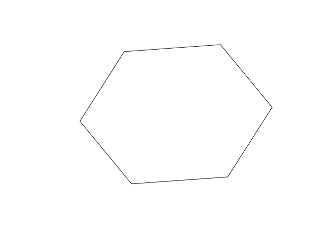

<!-- README.md is generated from README.Rmd. Please edit that file -->

# h3js

[](https://travis-ci.org/saurfang/h3js)
[](https://www.tidyverse.org/lifecycle/#experimental)
[](https://cran.r-project.org/package=h3js)

R bindings to [H3](https://github.com/uber/h3), a hexagon-based
geographic grid system via [h3-js](https://github.com/uber/h3-js).

R bindings via native H3 C library can be found at
[h3r](https://github.com/scottmmjackson/h3r). `h3r` is much faster but
requires installing `h3` separately.

**WARNING** Only functions that take non-array input support vectorized
operations currently. The return value of other functions when applying
vectorized input may be unspecified. You should map over those input
instead.

## Installation

You can install the released version of h3js from
[CRAN](https://CRAN.R-project.org) with:

``` r
install.packages("h3js")
```

Development version can be installed with:

``` r
devtools::install_github("saurfang/h3js")
```

## Core functions

``` r
library(h3js)
library(sf)
library(tidyverse)

# Convert a lat/lng point to a hexagon index at resolution 7
h3_index <- h3_geo_to_h3(37.3615593, -122.0553238, 7)
h3_index
#> [1] "87283472bffffff"

# Get the center of the hexagon
hex_center_coordinates <- h3_to_geo(h3_index)
hex_center_coordinates
#> [1]   37.35172 -122.05033

# Get the vertices of the hexagon
hex_boundary <- h3_to_geo_boundary(h3_index)
hex_boundary
#>          [,1]      [,2]
#> [1,] 37.34110 -122.0416
#> [2,] 37.35290 -122.0340
#> [3,] 37.36352 -122.0428
#> [4,] 37.36234 -122.0591
#> [5,] 37.35054 -122.0666
#> [6,] 37.33992 -122.0579

hex_boundary %>%
  # close polygon
  rbind(.[1,]) %>%
  # swap columns
  .[, c(2, 1)] %>%
  # convert to simple feature collection
  list() %>%
  st_polygon() %>%
  st_sfc() %>%
  plot()
```



## Useful algorithms

``` r
# Get all neighbors within 1 step of the hexagon
h3_k_ring(h3_index, 1)
#> [1] "87283472bffffff" "87283472affffff" "87283470cffffff" "87283470dffffff"
#> [5] "872834776ffffff" "872834729ffffff" "872834728ffffff"

# Get the set of hexagons within a polygon
polygon <- list(
    c(37.813318999983238, -122.4089866999972145),
    c(37.7198061999978478, -122.3544736999993603),
    c(37.8151571999998453, -122.4798767000009008)
)
hexagons <- h3_polyfill(polygon, 7)
hexagons
#> [1] "872830828ffffff" "87283082effffff" "87283082affffff" "87283082bffffff"
#> [5] "872830876ffffff" "872830820ffffff" "872830870ffffff"

# Get the outline of a set of hexagons, as a GeoJSON-style MultiPolygon
coordinates <- h3_set_to_multi_polygon(hexagons, TRUE)

c(
  coordinates %>%
    map(~ matrix(.x, ncol = 2)) %>%
    map(list) %>%
    st_multipolygon() %>%
    st_sfc(),
  do.call(rbind, polygon) %>%
    # close polygon
    rbind(.[1,]) %>%
    # swap columns
    .[, c(2, 1)] %>%
    list %>%
    st_polygon() %>%
    st_sfc()
) %>%
  st_sf() %>%
  plot()
```


## Benchmark

``` r
Houston <- list(lat = 29.7632836, lon = -95.3632715)

# single arguments
microbenchmark::microbenchmark(
  h3r::getIndexFromCoords(Houston$lat, Houston$lon, resolution = 5),
  h3_geo_to_h3(Houston$lat, Houston$lon, res = 5),
  h3r::getBoundingHexFromCoords(Houston$lat, Houston$lon, resolution = 5),
  h3_to_geo_boundary(h3_geo_to_h3(Houston$lat, Houston$lon, res = 5))
)
#> Unit: microseconds
#>                                                                     expr
#>        h3r::getIndexFromCoords(Houston$lat, Houston$lon, resolution = 5)
#>                          h3_geo_to_h3(Houston$lat, Houston$lon, res = 5)
#>  h3r::getBoundingHexFromCoords(Houston$lat, Houston$lon, resolution = 5)
#>      h3_to_geo_boundary(h3_geo_to_h3(Houston$lat, Houston$lon, res = 5))
#>       min        lq       mean    median        uq       max neval
#>    11.572   24.7375   41.46644   39.6285   52.1510   122.485   100
#>   742.427 1147.9030 1995.58544 1601.6880 2330.8450 11489.859   100
#>    17.031   27.6205  221.48883   50.7200   70.5675 16793.250   100
#>  1500.967 2104.0835 3411.27699 2920.7360 3930.8230 14837.502   100

# vectorized input
coordinates <- list(lat = runif(100, -90, 90), lon = runif(100, -180, 180))

microbenchmark::microbenchmark(
  pmap(coordinates, ~h3r::getIndexFromCoords(.x, .y, resolution = 5)),
  h3_geo_to_h3(coordinates$lat, coordinates$lon, res = 5)
)
#> Unit: microseconds
#>                                                                 expr
#>  pmap(coordinates, ~h3r::getIndexFromCoords(.x, .y, resolution = 5))
#>              h3_geo_to_h3(coordinates$lat, coordinates$lon, res = 5)
#>       min       lq     mean   median       uq       max neval
#>  1508.317 1847.437 3011.063 2236.570 2907.621 38565.621   100
#>   817.205 1114.620 1768.592 1368.635 1822.631  8248.186   100
```
